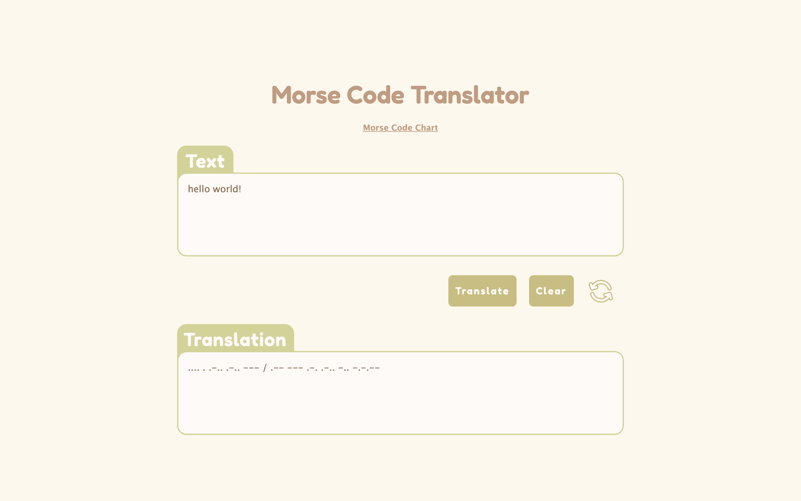

## Demo

- Live version can be viewed [here](https://sswolter.github.io/morse-code-translator/)

## Requirements / Purpose

The objective of this project was to develop a functional web page Morse Code translator. Additionally, I aimed to enhance my familiarity with Babel and Jest by implementing unit tests for all the logic functions.

#### Stack

- HTML
- SASS
- Javascript

## Features

- Translates English text to morse code and vice versa
- Legend for accepted characters
- Unit tests for logic functions

## Future Goals

- Automatically detect if a piece of text is english or morse and translate accordingly

## Change logs

#### 05/06/2023

- Added project information to readme
- Updated styling to enhance responsiveness
- Adjusted tests after changing the name of the variable storing data
